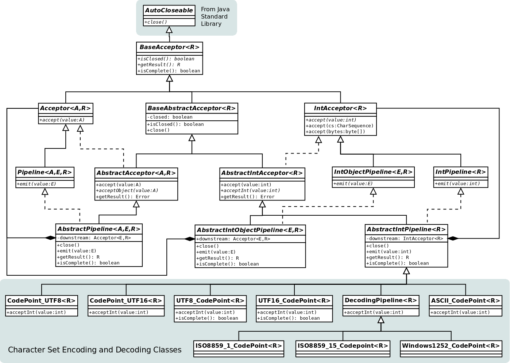

# pipelines

Pipeline library for Java

A collection of pipeline classes that take an input (frequently an `int` value) and produce a another value.
The conversion may be one-to-one, one-to-many or many-to-one.
A frequent use is for character encoding (conversion of bytes to characters and _vice versa_) and several classes are
provided to perform such conversions.

## Background

This project was born from a requirement for a mechanism to process a stream of characters, and output the results as
they become available.
The specific task was to process JSON data without aggregating the entire input into a string.
Processing the data a character at a time allows data to become available to the application sooner, and avoids the need
to allocate a buffer sufficiently large to hold the largest possible input.

But the JSON data in this case was not in character form, it was a stream of bytes.
That meant decoding from a character set (usually UTF-8) - another many-to-one pipeline process.
Thus was born the generalised pipeline library.

I considered using the Java `Consumer` and `IntConsumer` interfaces for the objects that accept input from the original
source or from the previous element of the pipeline, but I found I needed additional functionality beyond the simple
`accept` function those interfaces provide.
So this library defines an `Acceptor` interface; the `Pipeline` interface extends `Acceptor` and adds an `emit` function
to forward data to the downstream object.

## Concepts

### Parameterised Types

The classes and interfaces use the following naming convention for their parameterised types:

- `<A>`: the type that the class/interface accepts
- `<E>`: the type that the class/interface emits
- `<R>`: the "result" type (the pipeline may have a result type which gets propagated to the first element of the
pipeline; instances that don't need a result can use `Void`)

### Acceptor interface

This defines a small number of functions:

- `accept(value)`: accept a value (the implementation in `AbstractAcceptor` tests for `null` as an end-of-data marker,
and invokes the abstract method `acceptObject()` for non-null values)
- `close()`: inherited from the `AutoCloseable` interface (unfortunately, because the inherited signature specifies a
checked exception, many of the method signatures in the library also include this exception)
- `isClosed()`: returns `true` if the acceptor is closed
- `getResult()`: returns the result (the default implementation throws an exception)
- `isComplete(): `returns `true` if all many-to-one sequences are complete, for example, all the bytes in a UTF-8
multi-byte sequence have been received

### Pipeline interface

`Pipeline` extends `Acceptor` and adds:

- `emit(value)`: emit a value

### IntXxxx classes and interfaces

Because Java treats `int` more efficiently than the boxing class `Integer`, there are `IntXxxx` variants of many of the
elements.
And because many uses of `int` treat -1 as an end-of-data marker, this library also considers -1 as signifying end of
data.
That means that the `IntXxxx` classes include an `accept()` method that takes an `int`, performs the end-of-data test
and then calls an `acceptInt()` abstract method that must be overridden by the implementing class.

### AbstractXxxx classes

These provide default implementations for much of the functionality; implementing classes should generally derive from
these classes.

## Character Set Encoding and Decoding

The library includes several character set encoding and decoding classes, all of them implementing the `IntPipeline`
interface.

| Class                   | Accepts             | Emits               |
| ----------------------- | ------------------- | ------------------- |
| `UTF8_CodePoint`        | UTF-8               | Unicode code points |
| `UTF16_CodePoint`       | UTF-16              | Unicode code points |
| `ISO8859_1_CodePoint`   | ISO-8859-1          | Unicode code points |
| `ISO8859_15_CodePoint`  | ISO-8859-15         | Unicode code points |
| `Windows1252_CodePoint` | Windows-1252        | Unicode code points |
| `ASCII_CodePoint`       | Windows-1252        | Unicode code points |
| `CodePoint_UTF8`        | Unicode code points | UTF-8               |
| `CodePoint_UTF16`       | Unicode code points | UTF-16              |

Unicode code points are 32-bit quantities containing the full range of Unicode values; UTF-16 refers to the 16-bit
version of Unicode, with surrogate characters representing characters outside the "Basic Multilingual Plane".
Because Java mostly works with 16-bit characters, the `CodePoint_UTF16` pipeline will frequently be needed in
combination with the other classes.

## Class Diagram

The collection of classes rapidly grew to a large number, and to keep track of the whole library a class diagram is
helpful.

The following is a class diagram in UML form - or rather a rough approximation of UML.
In this diagram, the same rectangular block is used to represent an `interface` and a `class`.
An `interface`, like an `abstract class`, has its name in _italics_.

A solid line indicating inheritance is used both for both an `extends` relationship and a primary `implements`
relationship.
A dotted line represents a secondary `implements` relationship, where a class both extends a base class and implements
an interface.



The diagram was produced by [Dia](https://wiki.gnome.org/Apps/Dia/); the diagram file is at
[doc/dia/pipeline.dia](doc/dia/pipeline.dia).

## Example

To accept bytes in UTF-8 and aggregate them into a `String`:

```Java
public class ReadString {

    public String read(InputStream inputStream) throws Exception {
        IntPipeline<String> pipe = new UTF8_CodePoint<>(new CodePoint_UTF16<>(new StringAcceptor()));
        while (!pipe.isClosed())
            pipe.accept(inputStream.read());
        return pipe.getResult();
    }

    public static class StringAcceptor extends AbstractIntAcceptor<String> {
        private StringBuilder sb = new StringBuilder();
        @Override
        public void acceptInt(int value) {
            sb.append((char)value);
        }
        @Override
        public String getResult() {
            return sb.toString();
        }
    }

}
```

Peter Wall

2020-01-19
